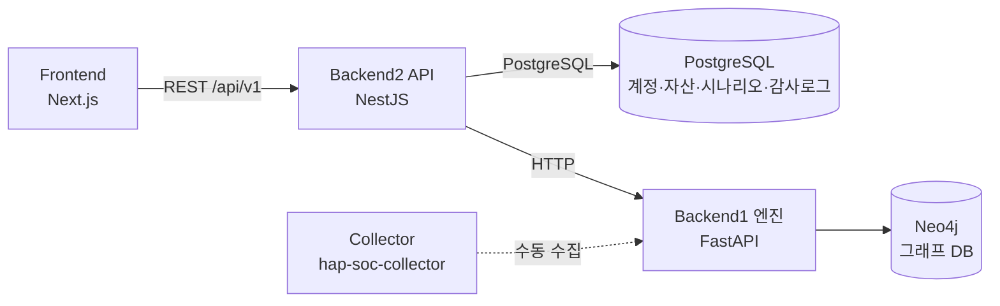

# 하이브리드 공격 경로 탐색 시스템 (Hybrid Attack Path Detection System)

**Team red-red** — KT tech up 사이버보안 2기 실무 프로젝트

하이브리드(온프레미스+AWS) 인프라의 자산·권한 관계를 수집해 Neo4j 그래프로
모델링하고, SOC 관점에서 공격 경로를 자동 탐색·시각화하는 시스템입니다.

## 핵심 컨셉

- **분석 대상(Prod)과 분석 시스템(SOC)의 분리**: 실제 취약점을 재현하는 대상 인프라(Prod VPC)와,
  그 인프라를 관찰·분석하는 SOC 인프라(SOC VPC)를 별도 VPC로 나눈 2-VPC 구조.
- **실제로 동작하는 취약 인프라 재현**: 문서상의 가상 시나리오가 아니라 Terraform으로 실제 배포한
  인프라(IAM 키·SG·IRSA 설정 등)에서 공격 경로가 재현되고, 그 경로를 Neo4j 그래프 쿼리로 검증합니다.
- **온프레미스 ↔ AWS 경계 이동**: 온프레미스 WordPress 서버에 저장된 IAM 액세스 키가 탈취되어
  AWS 리소스로 이동하는 경로(S3)가 대표 시그니처 시나리오입니다.

## 아키텍처

### 서비스 구성 (데이터 흐름)



- **Frontend**(Next.js): 로그인, 자산 목록, 시나리오/동적 공격 경로 그래프 시각화(Cytoscape.js), 감사 로그 화면
- **Backend2**(NestJS): 인증(JWT+RBAC), 자산·시나리오·감사로그 조회(PostgreSQL), Backend1 결과를 REST DTO로 변환하는 어댑터
- **Backend1**(FastAPI): Neo4j 그래프에서 고정 시나리오(S1~S4) 및 동적 경로를 Cypher로 탐색, 리스크 스코어링·탐지룰 제공
- **Collector**(`hap-soc-collector`): AWS 자산 인벤토리, Trivy 이미지 스캔, Scout Suite 계정 진단 도구 설치/실행 — 수집 결과가 Backend1 그래프 시드 데이터의 근거가 됨. *(Collector → Backend1 자동 연동 파이프라인 코드는 저장소에서 확인 안 됨 — 확인 필요)*

### 배포 구조 (`hap-soc-api` EC2)

```
ALB(443, hap-soc.kro.kr) → nginx:3000 → /api/*  → NestJS(내부 4000)
                                       → 그 외    → Next.js(내부 3001)
                                                        │
                                        NestJS → Backend1 FastAPI(hap-soc-graph, :8000)
```

`docker-compose.prod.yml` + `nginx/nginx.conf` 기준.

### AWS 인프라 — 2-VPC (Terraform 기준)

| VPC | 역할 | CIDR |
| --- | --- | --- |
| **Prod VPC** | 분석 대상 (Gitea/EKS·RDS·S3 등) | `10.0.0.0/16` |
| **SOC VPC** | 분석 시스템 (수집·Neo4j·API·로그) | `10.1.0.0/16` |

두 VPC는 VPC Peering으로 연결됩니다. 온프레미스(Vagrant, `192.168.0.0/24`)는 VPC가 아닌 별도 환경으로,
VPN 없이 IAM 액세스 키로만 AWS와 연동합니다. 상세 리소스 구성은 [`terraform/README.md`](terraform/README.md) 참고.

## 디렉터리 구조

```
.
├── terraform/                     # AWS 인프라(IaC) — Prod/SOC 2-VPC, EKS, RDS, S3, IAM 등
├── k8s/                           # EKS 위 Gitea 배포 매니페스트(Prod 대상 앱)
├── onprem/                        # 온프레미스 랩 (Vagrant: WordPress web + MySQL db)
├── collector/                     # hap-soc-collector 자산/취약점 스캔 도구 설치 스크립트
├── hybrid-attack-path-backend/    # Backend2 REST API (NestJS)
├── hybrid-attack-path-frontend/   # 웹 대시보드 (Next.js)
├── nginx/                         # 배포용 리버스 프록시 설정
└── docker-compose.prod.yml        # hap-soc-api EC2 배포용 compose (nginx+api+web)
```

Backend1(Neo4j 그래프 탐색 엔진, FastAPI)은 `feature/backend1-neo4j-engine` 브랜치에만 있고,
**아직 main에 병합되지 않았습니다** (담당자가 별도로 병합 예정). 아래 기술 스택·실행법은 해당 브랜치
코드를 직접 확인해 작성했습니다.

## 기술 스택

| 구성요소 | 스택 | 버전(코드 기준) |
| --- | --- | --- |
| Infra | Terraform, AWS Provider | Terraform `>= 1.5.0`, `hashicorp/aws ~> 5.0` |
| Backend1 (그래프 엔진) | Python, FastAPI, Neo4j | `requirements.txt`에 버전 미고정(`neo4j`, `fastapi`, `uvicorn`), Neo4j 이미지 `neo4j:5` |
| Backend2 (API) | NestJS, TypeORM, PostgreSQL | NestJS `^11.0.0`, TypeORM `^0.3.20`, Node.js 타입 `^22.10.0`, TypeScript `^5.6.0` |
| Frontend | Next.js, React, Cytoscape.js | Next.js `14.2.35`, React `^18`, Cytoscape.js `^3.34.0`, TypeScript `^5` |
| 인증 | JWT (Backend2) | Access 15분 / Refresh 7일 (`.env.example` 기준, `JWT_ACCESS_EXPIRES_IN` 기본값) |
| 리버스 프록시 | nginx | `nginx:1.27-alpine` (docker-compose.prod.yml) |

## 공격 시나리오 (S1~S4)

Backend1 `app/path_finder.py`의 `SCENARIOS` 정의 기준. 각 경로는 Cypher `MATCH path = (...)-[...]-(...)`로
Neo4j에서 직접 탐색됩니다.

| ID | 설명 | 그래프 경로 |
| --- | --- | --- |
| **S1-A** | dev-01 IAM 키 → 고객 S3 (직접 정책) | `Credential(hap-dev-01-access-key) -AUTHENTICATES_AS-> IAMUser(hap-dev-01-user) -HAS_PERMISSION-> IAMPolicy(hap-s3-access-policy) -CAN_ACCESS-> S3Bucket(hap-customer-data-s3)` |
| **S1-B** | dev-01 IAM 키 → readonly Role Assume → 고객 S3 | `Credential(hap-dev-01-access-key) -AUTHENTICATES_AS-> IAMUser(hap-dev-01-user) -ASSUMES_ROLE-> IAMRole(hap-s3-readonly-role) -HAS_PERMISSION-> IAMPolicy(hap-s3-readonly-policy) -CAN_ACCESS-> S3Bucket(hap-customer-data-s3)` |
| **S2** | 인터넷 → Prod ALB → Gitea Pod → RDS | `Internet(internet) -EXPOSED_TO_INTERNET-> ALB(hap-prod-alb) -CAN_MOVE_TO-> Pod(pod-gitea-app) -CONNECTS_TO-> RDS(hap-gitea-db)` |
| **S3** | 온프렘 WordPress IAM 키 → 고객 S3 (prefix 제한) | `OnPremWeb(hap-onprem-web) -HAS_CREDENTIAL-> Credential(hap-onprem-web-key) -HAS_PERMISSION-> IAMPolicy(hap-onprem-web-s3-policy) -CAN_ACCESS-> S3Bucket(hap-customer-data-s3)` (단, `resourcePrefix ∈ {wordpress-files/, wordpress-db/}`) |
| **S4** | Gitea Pod → IRSA → Secret → RDS | `Pod(pod-gitea-app) -USES_SERVICE_ACCOUNT-> ServiceAccount(gitea-sa) -IRSA_LINKED_TO-> IAMRole(hap-irsa-gitea-role) -HAS_PERMISSION-> IAMPolicy(hap-gitea-role-policy) -CAN_ACCESS-> SecretsManager(gitea-db-credentials) -CONNECTS_TO-> RDS(hap-gitea-db)` |

고정 시나리오 외에, `GET /dynamic-attack-paths`(Backend1)로 Neo4j 전체 그래프에서 실시간 동적 경로
탐색도 지원합니다(소스: `Internet`/`Credential`/`IAMAccessKey`/`IAMUser`/`Pod`/`ALB`/`OnPremWeb`/`OnPremDB`,
타깃: `sensitive=true` 노드 또는 `S3Bucket`/`RDS`/`SecretsManager`/`KMSKey`/`ECRRepository`). 실제 탐색되는
경로 개수는 그래프 데이터 상태에 따라 달라지며, 저장소에 고정된 수치는 없습니다 — **(확인 필요)**.

리스크 스코어는 `assetSensitivity + internetExposure + permissionRisk + hopRisk + findingRisk`
(최대 10.0)로 계산되며, `Finding`(Trivy/Scout Suite) 노드가 `HAS_FINDING`으로 연결된 경우 가산됩니다.

## Neo4j 그래프 모델

`docs/backend1-neo4j-design.md`, `scripts/seed.cypher` 기준(Backend1 브랜치).

**주요 노드 라벨**: `Internet`, `VPC`/`Subnet`, `ALB`, `EKSCluster`/`Pod`/`ServiceAccount`,
`IAMUser`/`IAMRole`/`IAMPolicy`, `Credential`/`IAMAccessKey`, `S3Bucket`/`LogPrefix`,
`RDS`/`SecretsManager`/`KMSKey`, `Scenario`/`Finding`/`Event`

**주요 관계 타입**: `EXPOSED_TO_INTERNET`, `ALLOWS_TRAFFIC`, `CAN_MOVE_TO`, `CONNECTS_TO`, `RUNS_ON`,
`USES_SERVICE_ACCOUNT`, `IRSA_LINKED_TO`, `HAS_CREDENTIAL`, `AUTHENTICATES_AS`, `ASSUMES_ROLE`,
`HAS_PERMISSION`, `CAN_ACCESS`, `ENCRYPTED_BY`, `LOGS_TO`/`HAS_LOG_PREFIX`, `MATCHES_SCENARIO`, `HAS_FINDING`

## 주요 API (Backend2, `/api/v1` prefix)

| 메서드/경로 | 설명 | 권한 |
| --- | --- | --- |
| `POST /auth/login` | 로그인, Access/Refresh 토큰 발급 | 전체 |
| `POST /auth/refresh` | Access 토큰 재발급 | 전체 |
| `GET /auth/me` | 내 정보 조회 | 로그인 필요 |
| `GET /assets`, `GET /assets/:id` | 자산 목록/상세 | VIEWER 이상 |
| `GET /scenarios`, `GET /scenarios/:id` | 시나리오 목록/상세 | VIEWER 이상 |
| `GET /graph` | 조건별 공격 경로 그래프 | VIEWER 이상 |
| `GET /graph/:scenarioId` | 시나리오별 그래프 | VIEWER 이상 |
| `GET /graph/paths` | 두 자산 간 경로 탐색 (Backend1 위임) | ANALYST 이상 |
| `GET /graph/dynamic` | 동적 공격 경로 탐색 (Backend1 위임) | VIEWER 이상 |
| `GET /logs` | 감사 로그 조회 | ADMIN |

Backend1(FastAPI)은 별도로 `GET /health`, `/scenarios`, `/attack-paths`, `/attack-paths/{id}`,
`/cytoscape`, `/detections`, `/detection-rules`, `/dynamic-attack-paths`를 제공합니다.

## 실행 방법

### 1. 인프라 (Terraform)

```bash
cd terraform
terraform init
terraform apply -var="analyst_ip_cidr=<본인 IP>/32"
```

`analyst_ip_cidr`은 기본값이 없어 필수 입력입니다. `iam_mode`(`vulnerable`/`remediated`, 기본 `vulnerable`),
`eks_stage`(`dev`/`presentation`), `prod_nat_count`(1/2) 등은 시연 단계에 따라 조정합니다. 상세는
[`terraform/README.md`](terraform/README.md) 참고.

### 2. Gitea 배포 (EKS)

`aws eks update-kubeconfig` 이후 AWS Load Balancer Controller·Secrets Store CSI Driver 설치,
이미지 미러링, 매니페스트 적용 순서는 [`k8s/README.md`](k8s/README.md) 참고.

### 3. 온프레미스 랩 (Vagrant)

```powershell
cd onprem
vagrant up hap-onprem-db
vagrant up hap-onprem-web
```

상세는 [`onprem/README.md`](onprem/README.md) 참고.

### 4. Backend1 그래프 엔진 (Neo4j + FastAPI) — `feature/backend1-neo4j-engine` 브랜치

```powershell
docker start hybrid-neo4j        # 최초 1회는 docker-compose.yml로 up (neo4j:5, ports 7474/7687)
docker cp .\scripts\seed.cypher hybrid-neo4j:/seed.cypher
docker exec hybrid-neo4j cypher-shell -u neo4j -p password1234 -f /seed.cypher
```

FastAPI 서버 기동 명령 자체는 저장소에 스크립트로 존재하지 않습니다. 포트는 `8000`(uvicorn 기본값)이
맞습니다 — Backend2 `.env.example`에 "uvicorn 기본 포트는 8000"이라는 주석과 함께
`GRAPH_ENGINE_BASE_URL=http://localhost:8000`이 명시되어 있고, Collector `.env.production.example`의
`GRAPH_ENGINE_BASE_URL`도 동일하게 `:8000`을 가리킵니다. 다만 정확한 실행 커맨드
(`uvicorn app.api_server:app --reload` 등 옵션 포함)는 문서화되어 있지 않습니다 — **(확인 필요)**.

### 5. Backend2 API (NestJS)

```bash
cd hybrid-attack-path-backend
docker compose up -d        # PostgreSQL
cp .env.example .env
npm install
npm run start:dev           # prestart:dev 훅으로 npm run seed 자동 실행
```

기본 포트 `3000` (`process.env.PORT` 미설정 시), Swagger UI: `http://localhost:3000/api/docs`.
`GRAPH_ENGINE_BASE_URL` 기본값은 `.env.example` 기준 Backend1 로컬 주소(uvicorn 기본 포트).

데모 계정(seed 후): `admin@hap.com` / `analyst@hap.com` / `viewer@hap.com` (각 `Admin1234!` 등, 역할별 RBAC 확인용).

### 6. Frontend (Next.js)

```bash
cd hybrid-attack-path-frontend
npm install
npm run dev
```

Backend2가 3000번을 쓰므로 프론트는 보통 3001번으로 뜹니다. `.env.local`에
`NEXT_PUBLIC_API_BASE_URL=http://localhost:3000/api/v1` 필요.

### 7. 프로덕션 배포 (`hap-soc-api` EC2)

```bash
docker compose -f docker-compose.prod.yml --env-file .env.production up -d --build
```

`.env.production`은 저장소에 커밋되지 않으며 `.env.production.example`을 참고해 서버에서 직접 작성합니다.

### 8. Collector (`hap-soc-collector` EC2)

```bash
sudo ./collector/install-tools.sh   # AWS CLI, nmap, Trivy, Scout Suite(venv 격리) 설치
cp collector/.env.production.example .env.production
```

스캔 실행/결과를 Backend1에 자동으로 밀어 넣는 파이프라인 코드는 이 저장소에서 확인되지 않습니다
— **(확인 필요)**.

## 위협 모델링 / 표준 매핑

- **MITRE ATT&CK**: 코드에서 실제 사용 확인됨 — Backend2 `Scenario` 엔티티의 `mitreTactics` 필드에
  시나리오별 전술(tactic)이 태깅되어 있습니다. 예: S1-A → `Credential Access`, `Exfiltration` / S2 →
  `Initial Access`, `Lateral Movement`.
- **STRIDE**: 저장소 코드·문서에서 명시적 참조를 찾지 못했습니다 — **(확인 필요)**.
- **NIST CSF (Identify·Protect·Detect·Respond·Recover)**: 저장소 코드·문서에서 명시적 참조를 찾지
  못했습니다 — **(확인 필요)**. 다만 `terraform/README.md`의 "보안 통제 기준선"(IAM 최소권한, SSM
  Session Manager, 암호화, 로깅)이 Protect/Detect 영역과 내용상 겹칩니다.

## 팀/역할

브랜치·문서에 팀명(**red-red**) 외 구성원별 역할을 명시한 자료는 확인되지 않아 생략합니다.
